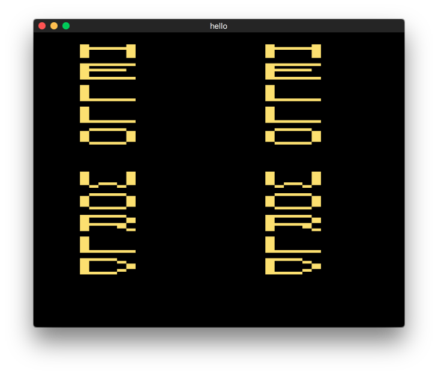
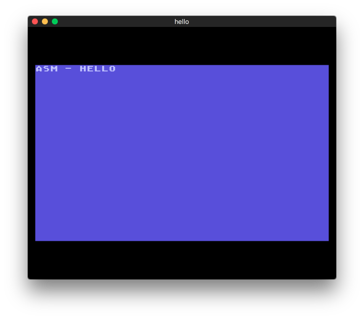
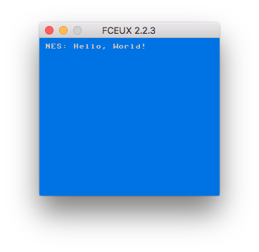
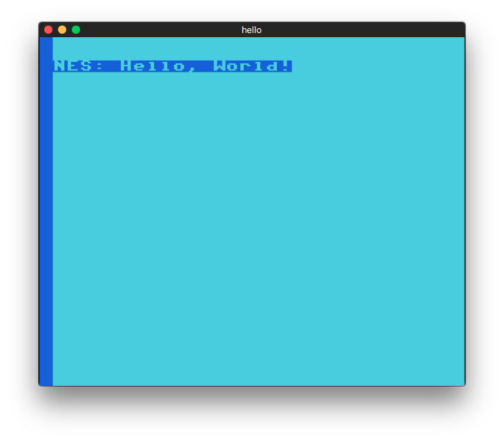

# ¿Qué es?

Servicio Docker para compilar juegos escritos en C y Assembly para Atari y NES utilizando Alpine Linux.

Suportados:
**Atari 2600, 5200, 7800, lynx e NES**

# Prerrequisitos

1. [Docker](www.docker.com) 18+
2. [VirtualBox](www.virtualbox.org) 6.0+ (Necesario sólo para Mac o Windows)
3. [Make](https://www.gnu.org/software/make)

# Emuladores
1. Atari 2600 - [Stella](https://stella-emu.github.io/) 4.7.3+
1. Atari 5200 - [Atari800](http://www.atarimac.com/atari800macx.php) 2.2.1+
1. Atari 7800 - [OpenEmu](http://openemu.org/) 2.0.4+
2. Atari Lynx - [Handy](http://bannister.org/software/handy.htm) 0.9.7+
3. NES - [FCEUX](http://www.fceux.com/) 2.2.3+
 
# Cómo empezar

Construir

```
make build
```

Correndo

```
make run
```

Por último, compile

### Atari 2600

```
cd atari-2600/asm/hello
make
```

```
dasm hello.asm -ohello.a26 -f3
```




### Atari 5200

```
atari-5200/c/hello
make
```

```
mv hiworld hiworld.xex
cp hiworld.atr.in hiworld.atr
/usr/bin/franny -A -i hiworld.xex -o HIWORLD.AR0 hiworld.atr
```

Salida


```
stella hello.a26
```


```
atari800 hello.a52
```



```
prosystem hello.a78
```



```
handy hello.lyx
```


```
fceux hello.nes
```




# Cómo detener

Tome el ID del CONTENEDOR

```
docker ps
```

```
CONTAINER ID        IMAGE                     COMMAND             CREATED              STATUS              PORTS               NAMES
529080b6b161        hldtux/game-dev-kit-cc65   "sh"                About a minute ago   Up About a minute                       boring_hodgkin
```

Parada

```
docker stop 529080b6b161
```

o

Destruyendo

```
docker rm 529080b6b161
```

# ¿Cuanto cuesta?

Sólo ~77MB!

Dónde:

Paquete | MB
--- | ---
AlpineLinux | 4
CC65 | 73

Mostrar docker imágenes

```
docker images
```

```
REPOSITORY                TAG                 IMAGE ID            CREATED             SIZE
hldtux/game-dev-kit-cc65   latest              8d717e697d42        51 seconds ago      77.3 MB
```

# Referencias

1. [docker.com](https://www.docker.com)

2. [hub.docker.com](https://hub.docker.com)

3. [alpinelinux.org](https://alpinelinux.org)

4. [cc65.org](http://www.cc65.org/)

5. [nesdoug.com](https://nesdoug.com/)

6. [atarilynxdeveloper.com](https://atarilynxdeveloper.wordpress.com/2012/04/05/programming-tutorial-part-1getting-started/)

7. [Compile Assembly Code for the Atari 2600](http://atariprojects.org/2019/01/20/compile-assembly-code-for-the-atari-2600-10-15-mins)